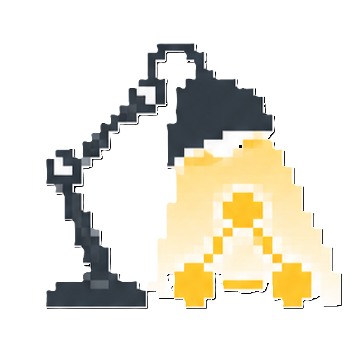

#  Tasklight

Tasklight is a small always-on-top desktop overlay for watching local AI coding agents in real time.

It listens for hook events over HTTP and shows per-agent state such as:

- `Thinking`
- `Tool: <name>`
- `Waiting for approval`
- `Done`

Today the project targets Claude Code and opencode hook payloads and renders them in a dockable PyQt6 desktop widget.

## Status

Tasklight is early-stage and actively evolving. The full product/design notes live in [spec/DESIGN.md](spec/DESIGN.md).

## Features

- PyQt6 overlay with translucent background and always-on-top window
- Live in-memory agent state model
- Local HTTP hook server on `127.0.0.1`
- Grouping by project directory
- Collapsible groups
- Click-to-dismiss for done agents
- Drag-to-dock behavior with multi-screen-aware snapping
- Hot-reloaded YAML config
- System tray menu

## Install and run

### Windows — pre-built executable

Download `tasklight.exe` from the [Actions](../../actions) tab (pick the latest `windows-exe` artifact from a `v*` tag build) and run it directly — no Python required.

### Python — uvx (recommended)

Download the `.whl` from the [Actions](../../actions) tab (the `linux-wheel` artifact), then run it with `uvx`:

```bash
uvx --from ./tasklight-*.whl tasklight
```

Or install it into a persistent tool environment:

```bash
uv tool install ./tasklight-*.whl
tasklight
```

### Python — from source

Requires Python `>=3.14` and [`uv`](https://docs.astral.sh/uv/).

```bash
uv sync
uv run tasklight
```

To use a different config path:

```bash
uv run tasklight --config PATH
```

## Manual Testing

Start Tasklight in one terminal, then in another run:

```bash
bash tests/manual.sh
```

That script sends synthetic `claude-code` and `opencode` events to the local hook server so you can exercise rendering, grouping, timers, and docking behavior.

## Hooks

This repository includes ready-to-adapt hook files in [hooks/](hooks/) for:

- Claude Code
- Codex CLI
- OpenCode

They all forward lifecycle/tool events to Tasklight’s local hook server.

### Shared behavior

- the default endpoint is `http://127.0.0.1:57017/hook`
- hook delivery is best-effort and intentionally ignores connection failures

### Claude Code

File: [hooks/claude.settings.json](hooks/claude.settings.json)

Requires: `curl` and `jq` on `PATH`. (Claude Code passes data via stdin JSON; `jq` extracts `session_id`, `cwd`, and `tool_name`.)

Install: merge the `hooks` block into either:

- project config: `.claude/settings.json`
- user config: Claude Code settings location

These hooks emit:

- `SessionStart` -> Tasklight `start`
- `UserPromptSubmit` -> `thinking`
- `PreToolUse` -> `tool_use`
- `PostToolUse` -> `thinking`
- `Stop` -> `stop`
- `SessionEnd` -> `exit`

### Codex CLI

File: [hooks/codex.hooks.json](hooks/codex.hooks.json)

Requires: `curl` and `jq` on `PATH`. (Codex passes data via stdin JSON rather than env vars; `jq` extracts `session_id`, `cwd`, and `tool_name`.)

Install: copy to `~/.codex/hooks.json`.

The included config wires these Codex events:

- `SessionStart`
- `UserPromptSubmit`
- `PreToolUse`
- `PostToolUse`
- `Stop`

### OpenCode

Files:

- [hooks/opencode-tasklight.js](hooks/opencode-tasklight.js)

Install:

1. Copy `hooks/opencode-tasklight.js` to one of:

```text
.opencode/plugins/tasklight.js
~/.config/opencode/plugins/tasklight.js
```

1. Restart OpenCode.

This plugin listens for:

- `session.created`
- `session.idle`
- `session.deleted`
- `tool.execute.before`
- `tool.execute.after`

### Notes

- Tasklight itself does not install these hooks automatically.
- If you changed Tasklight’s port, set `TASKLIGHT_URL` accordingly for the agent process that runs the hooks.
- Hook/config formats may evolve upstream; if one of these tools changes its hook schema, update the files under `hooks/` to match.

## Configuration

Tasklight reads a YAML config file, defaulting to `./tasklight.yaml`.

If the file does not exist, Tasklight writes a default one on startup.

Current config shape:

```yaml
port: 57017
dock:
  position: BR
  margin: 16
  width: 360

theme:
  background: "#1e1e1e"
  background_alpha: 0.85
  foreground: "#e8e8e8"
  dimmed: "#888888"
  use_system_cursor: true
  animate_spinners: true
  accent_done: "#44cc77"
  accent_approval: "#ff4444"
  approval_row_bg: "#3a2800"
  font_family: "monospace"
  font_size_px: 13
  corner_radius: 10

timeouts:
  done_auto_remove_s: 0
  exit_grace_s: 30
```

Most config changes hot-reload automatically. Port changes still require a restart.

## Hook Payload

The HTTP server accepts requests to `http://127.0.0.1:57017/hook` in two formats:

**GET with query params** (used by Claude Code and Codex hooks):

```text
GET /hook?source=claude-code&session_id=abc123&cwd=%2Fpath%2Fto%2Fproject&event=tool_use&tool_name=Bash
```

**POST with JSON body** (used by the OpenCode plugin):

```json
{
  "source": "claude-code",
  "session_id": "abc123",
  "cwd": "/absolute/path/to/project",
  "event": "tool_use",
  "data": {
    "tool_name": "bash"
  }
}
```

Supported events:

- `start`
- `thinking`
- `tool_use`
- `tool_result`
- `approval_required`
- `approval_granted`
- `stop`
- `exit`

## Project Layout

```text
tasklight/
├── tasklight.spec          # PyInstaller build spec
├── spec/
│   └── DESIGN.md
├── tests/
│   └── manual.sh
└── tasklight/
    ├── __main__.py         # entry point (python -m tasklight)
    ├── app.py              # bootstrap, cli() entry point
    ├── config.py
    ├── dialogs.py
    ├── model.py
    ├── server.py
    ├── tray.py
    └── overlay/
        ├── layout.py
        ├── presentation.py
        ├── types.py
        ├── view_model.py
        └── widget.py
```

## Architecture Notes

- The Qt GUI runs on the main thread.
- The hook server runs in a `QThread` and emits events back to the GUI thread.
- All runtime agent state is in memory.
- The overlay is split into pure row/layout logic and Qt painting/interaction code.

## Development

Useful commands:

```bash
uv run tasklight
uv run tasklight --config PATH
uv run python -m py_compile tasklight/*.py tasklight/overlay/*.py
bash tests/manual.sh
```

## Agent Docs

- [CLAUDE.md](CLAUDE.md) contains Claude Code-specific guidance for this repository.
- [AGENTS.md](AGENTS.md) contains general guidance for coding agents working in this repo.
