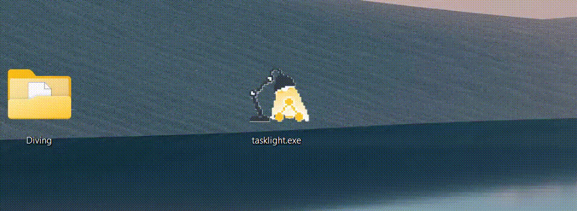

#  Tasklight

Tasklight is a small always-on-top desktop overlay for watching local AI coding agents in real time. It listens for hooks over HTTP and shows per-agent state in a small floating window that can be docked.



Today the project targets Claude Code, Codex, and opencode hook payloads and renders them in a dockable PyQt6 desktop widget.

Tasklight is a tiny product that your agent can customize to your heart's desire. The full product/design notes live in [spec/DESIGN.md](spec/DESIGN.md).

## Features

- PyQt6 overlay with translucent background and always-on-top window
- Local and remote agent monitoring in a single app.
- Multiple agents per project dir, each tracked separately.
- Collapsible groups
- Click-to-dismiss for done agents
- Drag-to-dock behavior with multi-screen-aware snapping

## Install and run

### Windows — pre-built executable

Download `tasklight.exe` from the [Releases](https://github.com/gauravmm/tasklight/releases) page and run it directly — no Python required.

### Python — uvx (recommended)

Run directly without installing:

```bash
uvx --from git+https://github.com/gauravmm/tasklight tasklight
```

Or install into a persistent tool environment:

```bash
uv tool install git+https://github.com/gauravmm/tasklight
tasklight
```

## Hooks

This repository includes ready-to-adapt hook files [hooks/](https://github.com/gauravmm/tasklight/tree/master/hooks/). Install them with the prompt:

```
I use Tasklight (https://github.com/gauravmm/tasklight) to monitor AI agents in real time.
Install the hook for this agent by following the instructions at:
https://github.com/gauravmm/tasklight/tree/master/hooks

If this machine is running in WSL2 and Tasklight is running on the Windows host, also ask
me whether SSH reverse port forwarding should be configured so Tasklight can receive events
from remote sessions. If so, help me add a RemoteForward entry to ~/.ssh/config using the
Windows hostname (run `hostname.exe` to get it).
```

### Over the Network

To monitor agents running on a remote machine, use SSH reverse port forwarding so the remote machine's hook calls tunnel back to your local Tasklight:

```bash
ssh -R 57017:localhost:57017 yourserver
```

Or add it permanently to `~/.ssh/config`:

```
Host yourserver
    RemoteForward 57017 localhost:57017

# If SSH runs on WSL2 and you run tasklight on Windows:
Host yourserver
    RemoteForward 57017 YOUR-PC-NAME:57017
```

## Configuration

Tasklight reads a YAML config file, defaulting to `./tasklight.yaml`. If the file does not exist, Tasklight writes a default one on startup.

```yaml
port: 57017

# Subnets allowed to send hook events. Hot-reloads without restart.
# Add e.g. 192.168.0.0/16 to accept hooks from LAN or a remote SSH forward.
allowed_subnets:
  - 127.0.0.0/8    # loopback
  - 172.16.0.0/12  # WSL2 host-guest NAT range

dock:
  position: BR
  margin: 16
  width: 240

theme:
  background: "#1e1e1e"
  background_alpha: 0.85
  foreground: "#e8e8e8"
  dirname_fg: "#888888"
  hostname_fg: "#5599cc"
  system_cursor: true
  animate_spinners: true
  done_fg: "#44cc77"
  done_bg: ""
  approval_fg: "#ff4444"
  approval_bg: "#a47000"
  font_family: "monospace"
  font_size: 13
  corner_radius: 10

timeouts:
  done_auto_remove_s: 0
  exit_grace_s: 30
```

Most config changes hot-reload automatically. Port changes require a restart.
